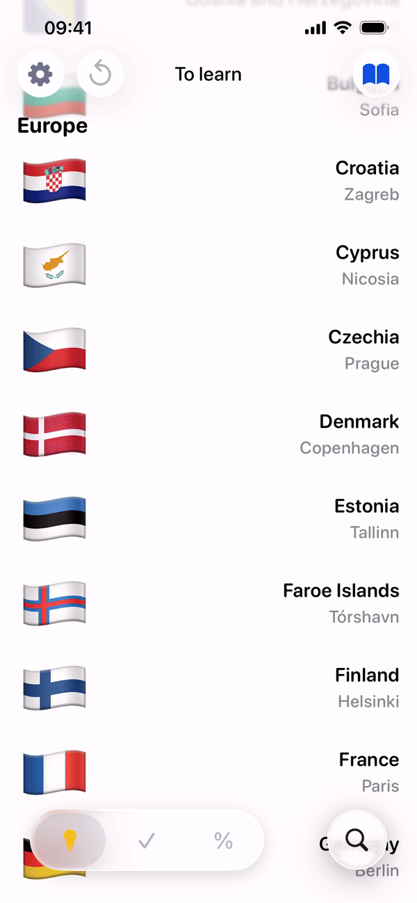
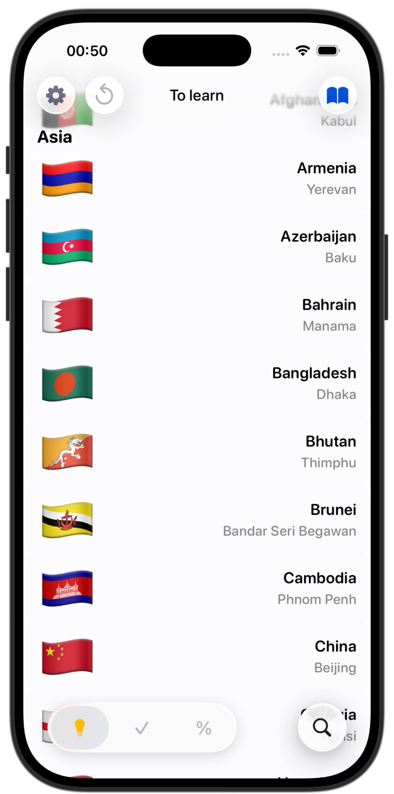
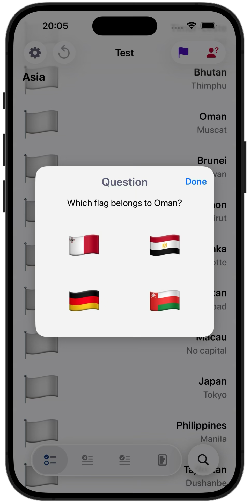
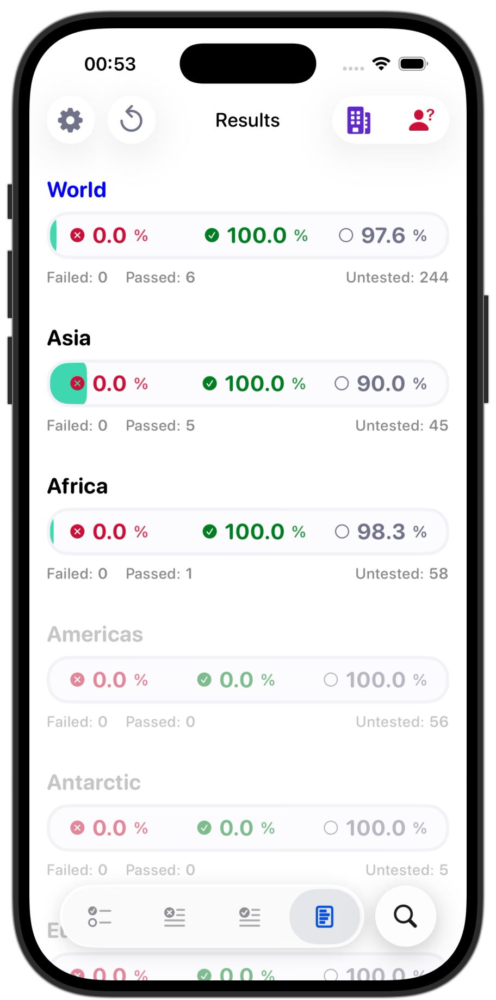

# CountryMaster

CountryMaster is a lightweight iOS app for learning and testing world geography.
Built with UIKit and a fully programmatic UI, the app focuses on clarity, smooth interactions, and a distraction-free learning experience.

<p align="center">
  
</p>

## Screenshots

<p align="center">
  
  
  
</p>

## Purpose

CountryMaster helps users **learn and test geography in a structured and intuitive way**.

The app is designed to:
 - simplify memorizing countries, capitals, and flags,
 - provide clear learning progress by continents,
 - offer multiple testing modes with visual feedback,
 - keep the interface clean, readable, and calm — without overload.

This project demonstrates practical UIKit skills, state-driven UI updates, and clean separation of concerns, wrapped in a polished and modern user experience.

## Features

### Learning Mode
- Country list grouped by continents.
- Progress tracking with clear states:
  - **To Learn**
  - **Learned**
  - **Progress** (statistics per continent)
- Swipe actions to mark countries as learned or unlearned.

### Testing Mode
- Test by:
  - **Capitals**
  - **Countries**
  - **Flags**
- Test result tracking:
  - Remaining countries to test
  - **Review** (failed answers)
  - **Passed**
  - Detailed statistics per continent

### Answers Masking Settings
- **Lite** — shuffled letters.
- **Normal** — masked text (`****`).
- **Hard** — fully masked with a constant number of symbols.
- Mask mode is configurable in **Settings** and persisted between app launches.

### UI & UX
- Fully programmatic UI (no Storyboards).
- Smooth animated transitions between modes and segments.
- Adaptive layout for different screen sizes.
- Bottom control bar with glass / blur appearance.
- Search support for fast country lookup.

---

## Tech Stack

- **Swift, UIKit** — fully programmatic UI
- `UICollectionView` with:
  - list layout (learning),
  - compositional layout (statistics)
- **MVC architecture**
- Persistence via **UserDefaults** and **FileManager**
- Adaptive layout using `scaleFactor`
- Custom UI components:
  - `BottomControlBar`
  - Statistics views
  - Learning / Testing mode selector
  - Custom color assets
- Smooth animations using `UIView.transition` and cross-dissolve effects

## Project Structure

```text
API/
    CountryService.swift                // Fetches country data from the REST Countries API

ContinentsCollectionView/
    LearnStats/
        LearnProgressView.swift         // Custom progress view for learning statistics
        LearnStatsCell.swift            // UICollectionViewCell displaying learning statistics
        LearnStatsFooter.swift          // Footer view for learning statistics section
        LearnStatsHeader.swift          // Header view for learning statistics section

    TestStats/
        TestProgressView.swift          // Custom progress view for testing progress
        TestStatsCell.swift             // UICollectionViewCell displaying testing progress
        TestStatsFooter.swift           // Footer view for testing progress section
        TestStatsHeader.swift           // Header view for testing progress section

    ContinentFooter.swift               // Footer view for continent sections
    ContinentHeader.swift               // Header view for continent sections
    CountryCell.swift                   // UICollectionViewCell displaying country information

Data/
    ContinentsData.swift                // Root model representing the entire world
    TestData.swift                      // Defines what exactly is tested for a country
    UserConfigData.swift                // Defines user-selected study configuration

Model/
    CountryModel.swift                  // Core application data model
    Settings.swift                      // Static and structured settings used by SettingsViewController

Persistence/
    DataStore.swift                     // Responsible for persisting user data

ViewControllers/
    CountryViewController.swift         // Main screen of CountryMaster
    SettingsViewController.swift        // Displays application settings
    StudyModeViewController.swift       // Screen for selecting study mode (Learning / Testing)
    TestQuestionViewController.swift    // Modal controller presenting a single test question

Views/
    BottomControlBar.swift              // Bottom control bar for navigating Learning and Testing modes
    ContinentPickerView.swift           // Single-column picker displaying continent names

Global.swift                            // Shared types and helpers (constants, enums, extensions)
```

## Requirements
 - **OS 16.6+**
 - Xcode 16+


## Installation

Clone the repository and open the project in Xcode:

```bash
git clone https://github.com/dsokolovdev/CountryMaster.git
cd CountryMaster
open CountryMaster.xcodeproj
```

## ❤️ Author

Created by Dmitry Sokolov  
© 2025
